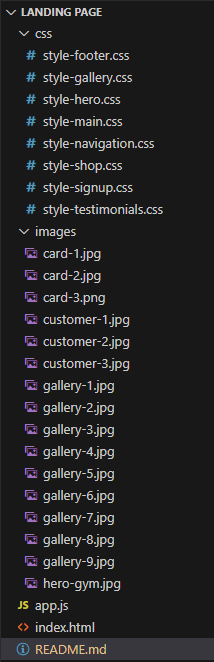

# PROJECT: Fitness World Landing Page

# TABLE OF CONTENT

1. [Description](#DESCRIPTION)
2. [Files and Folders](#FILES-AND-FOLDERS)
3. [Landing Page Behaviours](#LANDING-PAGE-BEHAVIOURS)

# DESCRIPTION

This landing page is based on a fictional gym. It is divided into 6 sections:

1. Header/Navigation
2. Hero
3. Photo Gallery
4. Accessories
5. Sign Up
6. Testimonials
7. Footer

# FILES-AND-FOLDERS

# LANDING-PAGE-BEHAVIOURS

\_Below are the sections and the functionality it has and how to interact with it to demonstrate my DOM manipulation skills. I'll only detail the sections which have major interactions.

### Navigation

I've used Document Fragment to dynamically list out the navigation links. Each time the user clicks on the link, it'll highlight the link. It would then scroll to the relevant section. The Header/Navigation container is also fixed, so it'll always be displays even when scrolling. This will also then add colour to the background of the selected section.
Once the user clicks on the other link, it turn remove the highlight from the previous selected link. Background colour of the previous selected section is also removed.

### Photo Gallery

Since the image files took a long time to load each time I reloaded the page, I use Document Fragment which improved the performance significantly.

### Accessories

When the user clicks the + icon, the value of the text field increments by 1. If - is pressed, the value decrements by 1. If the current value is greater than 0, then user can press 'Add to Cart' which will turn the button red and change text to 'Remove from Cart'. This will not work if the current value is 0. User cannot get anything less than 0. If the user clicks on 'Remove from Cart', the quantity value resets to 0.

### Sign Up

When a user enter an email in the text field and hits +, it'll keep appending the value underneath. Once entered, it will clear the text field. This will only work if there is a value in the text field.

### Testimonials

Each time the user clicks on a photo, a review will be displayed underneath. For each photo is clicked, the previous review will disappear and the current selected one will appear.
